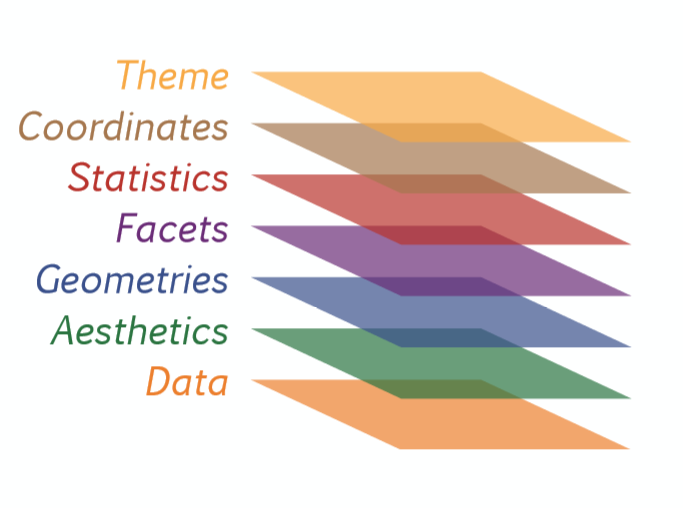
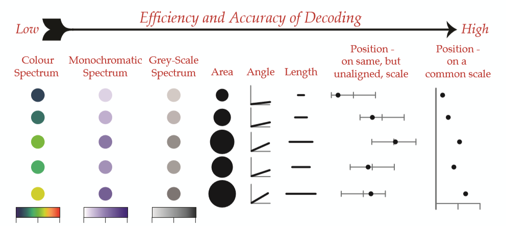

```{r setup, include=FALSE}
library(ggplot2)
library(dplyr)
library(knitr)
library(tidyr)
options(scipen = 999)
anscombe_tidy <- anscombe %>% gather() %>%
  separate(col = key, c('variavel', 'conjunto'), sep = 1) %>%
  group_by(variavel) %>% mutate(row = 1:n()) %>%
  spread(variavel, value) %>% select(-row)

dados <- readRDS('amostra-PAM.RDS')
dados <- dados %>% filter(cultura %in% c("Arroz (em casca)", "Feijão (em grão)",
                                         "Soja (em grão)", "Milho (em grão)" ))
```

## Exemplo

```{r}
ggplot(dados, aes(x = cultura, y = produtividade, fill = cultura)) +
  geom_violin(draw_quantiles = 0.5)
```


<!-- ## Exemplo -->

<!-- ```{r diamonds, echo=FALSE} -->
<!-- ggplot(dados, aes(x = produtividade, y = area_plantada, col = regiao)) + -->
<!--   geom_point(aes(size = VBP)) + -->
<!--   geom_smooth(se = FALSE, method = "lm") + -->
<!--   facet_wrap(~cultura, nrow = 2, scales = "free") -->
<!-- ``` -->

## Por que uma **gramática** dos gráficos?

### Quarteto de Anscombe

```{r, echo = FALSE}
kable(anscombe[, c(1,5,2,6,3,7,4,8)])
```

## Por que uma **gramática** dos gráficos?

### Quarteto de Anscombe

```{r,  echo = FALSE}
ggplot(anscombe_tidy, aes(x,y)) +
  geom_point() +
  geom_smooth(method = "lm",se = FALSE) +
  facet_wrap(~conjunto, nrow = 2) + theme_bw()
```

## Concepção do ggplot2

O ggplot2 é mais do que um pacote para fazer gráficos; ele é uma tentativa (muito bem sucedida) trazer para o dia-a-dia dos técnicos uma **gramática dos gráficos**.


#### Por que uma **gramática** dos gráficos?

Através dela podemos definir **sistematicamente** quais são os componentes de um gráficos e como eles se interelacionam.

Veja mais informações em [http://docs.ggplot2.org/](http://docs.ggplot2.org/current/).

## A gramática dos gráficos



## A gramática dos gráficos

|       elemento       |        exemplos         |
|:--------------------:|:-----------------------:|
|  dados (informação)* | produção, fiscalizações |
|   **(a)es**tética*   |      cor, formato       |
|    **geom**etrias*   |      barra, ponto       |
|    e**stat**ísticas  |    mediana, máximo      |
|     **facet**as      |        facetas          |
|   **coord**enadas    |    polar, cartesiana    |
|     **t(h)emas**     |      eixos, título      |

'* aspéctos estéticos impressindíveis para criar um gráfico no ggplot2

## Sintaxe do ggplot2

Explicar a sintaxe, papel do +, as funções aes, geom e ggplot.

## A camada de dados

A primeira etapa da construção de um gráfico é ter os dados que serão representados graficamente. Vamos carregar os dados da Pesquisa Agrícola Municipal (PAM) agregados no nível de grandes regiões para os anos entre 1990 e 2015.

```{r carga, eval=FALSE}
# importa dados
dados <- readRDS('amostra-PAM.RDS')
```


## Ainda os dados

Ainda precisamos melhorar um pouco a forma como os dados chegaram. O arquivo "amostra-PAM.RDS" traz dados de `r length(unique(dados$cultura))` culturas diferentes e é difícil visualizar tantas variáveis categóricas. Para faciliar as coisas vamos reduzir nossos dados apenas para as culturas de **arroz**, **feijão**, **milho** e **soja** (grãos) com o código abaixo. 

```{r transforma, warning=FALSE, message = FALSE}
dados <- dados %>% filter(cultura %in% c("Arroz (em casca)", "Feijão (em grão)",
                                         "Soja (em grão)", "Milho (em grão)" ))
dados2 <- dados %>% filter(cultura == "Feijão (em grão)")
```

## Aspectos Estéticos

Os principais aspectos estéticos são:

Estética | Descrição
----------|----------------------------------------
x | Eixo horizontal
y | Eixo vertical
colour | Cor dos pontos ou das linhas das formas
fill | Cor de preencimento 
size | Diametro dos pontos e espessura das linhas
alpha |Transparência
linetype | Tipo (padrão) da linhas
labels | Texto no gráfico ou nos eixos
shape | Forma

## Atributos Estéticos

É diferente **mapear** uma estética e **definir um atributo estético**. Mapear uma variável em uma estética é dizer que a cor **vermelha** representa o Centro-Oeste e a cor **azul** o Sudeste. Isto é diferente de definir a cor de pontos ou barras com a cor **verde**. 

## Atributos Estéticos

### Atribuir cor à elemento estético

```{r}
ggplot(dados2 , aes(x = area_plantada, y = quantidade)) +
  geom_point(col = "red")
```

## Mapeando dados na estética

Imagine que você fosse desenhar um gráfico. Como você decidiria até onde deve ir a barra ou onde ficariam os pontos? O computador também precisa de critérios para decidir como representar os dados, como o Valor Bruto da Produção agropecuária (VBP) de uma região, em um gráfico.

Assim, o VBP pode ser representado no eixo vertical ou os faixas de valores podem aparecer como cores ou formato dos dados (até R$ 50 milhões triângulos, entre 50 e 100 quadrados, maiores que 100 circulos).

### Mapear a região na cor

```{r}
ggplot(dados2 , aes(x = area_plantada, y = quantidade) +
  geom_point(aes(col = regiao)))
```

## Aspectos Estéticos - Variáveis contínuas

Estética | Descrição
----------|----------------------------------------
x | Eixo horizontal
y | Eixo vertical
colour | Cor dos pontos ou das linhas das formas
fill | Cor de preencimento 
size | Diametro dos pontos e espessura das linhas
alpha |Transparência

## Atributos Estéticos - Variáveis contínuas



Fonte: www.datacamp.com

## Aspectos Estéticos - Variáveis categóricas

Estética | Descrição
----------|----------------------------------------
colour | Cor dos pontos ou das linhas das formas
fill | Cor de preencimento 
size | Diametro dos pontos e espessura das linhas
alpha |Transparência
linetype | Tipo (padrão) da linhas
labels | Texto no gráfico ou nos eixos
shape | Forma

## Atributos Estéticos - Variáveis categóricas


Fonte: www.datacamp.com

## Aspectos Geométricos

Além de ter dados e mapeá-los em atributos estéticos, você deve escolher com que geometrias quer aprensentar seus dados.

As geometrias mais comuns são:

* Pontos (diagrama de dispersão)

* Barras

* Linhas

* Diagrama de baixa (boxplot)

Vamos ver como usar estas geometrias no `ggplot2`.

## geom_point()

```{r geom_point}
ggplot(dados, aes(x = quantidade, y = area_plantada)) +
  geom_point()
```

## geom_col()

```{r geom_bar}
medias <- dados %>% group_by(cultura) %>%
  summarise(area_media = mean(area_plantada))

ggplot(medias, aes(x = cultura, y = area_media)) +
  geom_col()
# gráficos de barras são geralmente usados em estatísticas sumarizadas
```

## geom_histogram()

```{r geom_histogram, warning=FALSE}
ggplot(dados, 
       aes(x = produtividade)) +
  geom_histogram(binwidth = 800, alpha= 0.8) # definir qtd de intervalos(bins)
```


## Ou então geom_density()

```{r geom_density}
ggplot(dados,
       aes(x = produtividade, fill = cultura)) +
  geom_density(alpha= 0.6)
```


## geom_line() 

```{r geom_line}
ggplot(dados,
       aes(Ano, area_plantada, col = regiao)) +
  geom_path()
```

## geom_boxplot()

```{r geom_boxplot}
ggplot(dados,
       aes(x = cultura, y = produtividade)) +
  geom_boxplot(aes(fill = cultura))
```

## Estatísticas

Toda geometria está vinculada a alguma estatística. Esta estatística pode ser "identidade", isto é, o dados tal qual. Mas, observem, seria impossível desenhar algumas geometrias sem obter algumas estatísticas sobre os dados. O ggplot2 faz isso por trás das cenas para nós.

Por exemplo, para desenhar um diagrama de caida sobre precisa saber: i) o desvio padrão, ii), a mediana, iii) os 1º e 3º quartis. Um histograma, por sua vez, precisa i) definir classes de intervalos e ii) contar a quantidade de dados nestes intervalos.

Caso precisemos gerar as estatísticas, o `ggplot2` tem a família de funções `stat_*`. Vejamos um exemplo

## Estatísticas

```{r Estatística}
ggplot(dados, 
       aes(x = produtividade, y = VBP, col = cultura)) +
  geom_point() +
  stat_smooth(geom = "smooth", method = "lm", se = FALSE)
# realizou calculos de regressão

```


## Coordenadas e Facetas

```{r Facetas}

```


## Tema

```{r Tema}

```
